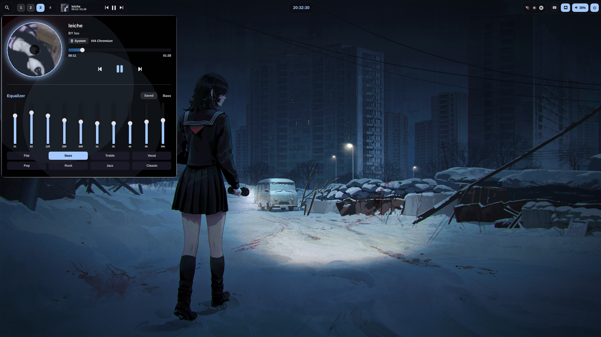
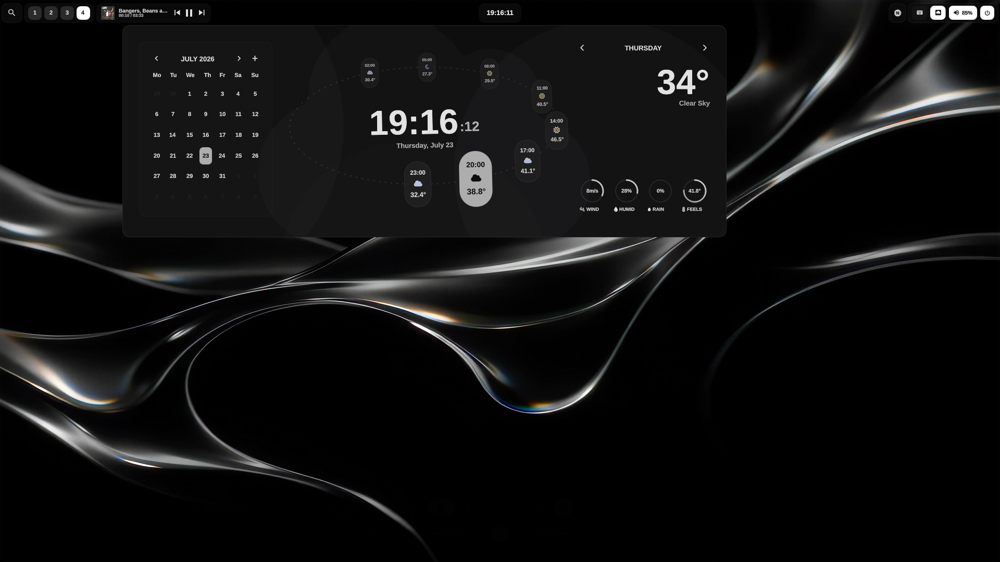
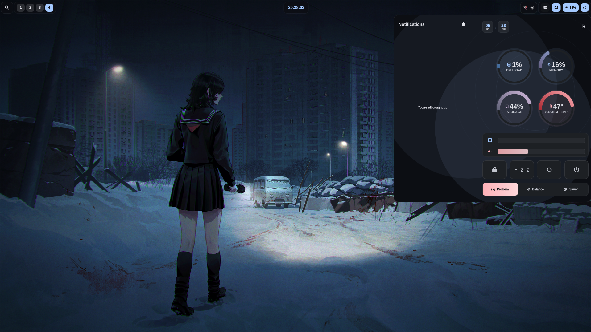

  

<h1 align="center">Calditum Shell</h1>

  Un fork del shell original creado por <a href="https://github.com/ilyamiro">ilyamiro</a>.

  <strong>🚧 STILL WORK IN PROGRESS 🚧</strong>

---

## 🎨 Wallpapers

Puedes encontrar todos mis wallpapers **[aquí](https://github.com/ilyamiro/shell-wallpapers)**.

## 🖥️ Vista previa del escritorio

  
  
  

---

  Basado en el trabajo original de <a href="https://github.com/ilyamiro">ilyamiro</a> — todo el crédito por el diseño original le pertenece.

